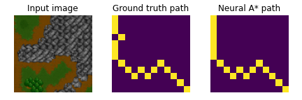

# Path Planning using Neural A\* Search (ICML 2021)

This is the official repository for the following paper:

Ryo Yonetani*, Tatsunori Taniai*, Mohammadamin Barekatain, Mai Nishimura, Asako Kanezaki, "Path Planning using Neural A\* Search", ICML, 2021 [[paper]](https://arxiv.org/abs/2009.07476) [[project page]](https://omron-sinicx.github.io/neural-astar/)

## TL;DR

Neural A\* is a novel data-driven search-based planner that consists of a trainable encoder and a differentiable version of A\* search algorithm called differentiable A* module. Neural A\* learns from demonstrations to improve the trade-off between search optimality and efficiency in path planning and also to enable the planning directly on raw image inputs.

| A\* search | Neural A\* search | Planning on raw image input | 
|:--:|:--:|:--:|
|  | |  |


## Overview
- This branch presents minimal working examples for training Neural A* to (1) solve shortest path problems and (2) perform planning directly on [WarCraft map images](https://edmond.mpdl.mpg.de/dataset.xhtml?persistentId=doi:10.17617/3.YJCQ5S).
- For reproducing experiments in our ICML'21 paper, please refer to [icml2021](https://github.com/omron-sinicx/neural-astar/tree/icml2021) branch.
- For creating datasets used in our experiments, please visit [planning datasets](https://github.com/omron-sinicx/planning-datasets) repository.

## Getting started
- Try Neural A* on Google Colab! [](https://colab.research.google.com/github/omron-sinicx/neural-astar/blob/minimal/notebooks/example.ipynb)
- The code has been tested on Ubuntu >=18.04 as well as WSL2 (Ubuntu 20.04) on Windows 11, with python3 (>=3.8). Planning can be performed only on the CPU, and the use of GPUs is supported for training/evaluating Neural A\* models. We also provide Dockerfile and docker-compose.yaml to replicate our setup.

### Installation (venv)
```sh
$ git clone --recursive https://github.com/omron-sinicx/neural-astar
$ python -m venv .venv
$ source .venv/bin/activate
(.venv) $ pip install .[dev]
```

or with docker compose

```sh
$ docker compose build
$ docker compose up -d neural-astar
$ docker compose exec neural-astar bash
```

## Perform shortest path search with Neural A\* 
See [`notebooks/example.ipnyb`](https://github.com/omron-sinicx/neural-astar/tree/minimal/notebooks/example.ipynb) for how it works.

### Training
```sh
(.venv) $ python scripts/train.py
```

You can also visualize and save planning results as gif. 
```sh
(.venv) $ python scripts/create_gif.py
```


## Perform planning on WarCraft data [2] with Neural A\* 


### Preparation
- Download `warcraft_maps.tar.gz` from [Blackbox Combinatorial Solvers page](https://edmond.mpdl.mpg.de/dataset.xhtml?persistentId=doi:10.17617/3.YJCQ5S). [2]
- Extract the directory named `12x12` (smallest maps) and place it on the root of this project directory.

### Training
```sh
(.venv) $ python scripts/train_warcraft.py
```

Once training has been done, open [`notebooks/example_warcraft.ipnyb`](https://github.com/omron-sinicx/neural-astar/tree/minimal/notebooks/example_warcraft.ipynb) to see how it works.

## FAQs

### Data format (c.f. https://github.com/omron-sinicx/neural-astar/issues/1#issuecomment-968063948)

The datafile `mazes_032_moore_c8.npz` was created using our data generation script in a separate repository https://github.com/omron-sinicx/planning-datasets.

In the data, `arr_0` - `arr_3` are 800 training, `arr_4` - `arr_7` are 100 validation, and `arr_8` - `arr_11` are 100 test data, which contain the following information (see also https://github.com/omron-sinicx/planning-datasets/blob/68e182801fd8cbc4c25ccdc1b14b8dd99d9bbc73/generate_spp_instances.py#L50-L61):

- `arr_0`, `arr_4`, `arr_8`: binary input maps
- `arr_1`, `arr_5`, `arr_9`: one-hot goal maps
- `arr_2`, `arr_6`, `arr_10`: optimal directions (among eight directions) to reach the goal
- `arr_3`, `arr_7`, `arr_11`: shortest distances to the goal

For each problem instance, the start location is generated randomly when `__getitem__` is called: https://github.com/omron-sinicx/neural-astar/blob/e6e626c4d159b0e4c58ee6ad33c7e03db33d72f4/neural_astar/utils/data.py#L114

## Third-party implementations

- [shreya-bhatt27/NeuralAstar-ported](https://github.com/shreya-bhatt27/NeuralAstar-ported): Pytorch Lightning implementation with some additional experiments. See also [their preprint](https://arxiv.org/abs/2208.04153).

## Citation

```
# ICML2021 version
@InProceedings{pmlr-v139-yonetani21a,
  title =      {Path Planning using Neural A* Search},
  author    = {Ryo Yonetani and
               Tatsunori Taniai and
               Mohammadamin Barekatain and
               Mai Nishimura and
               Asako Kanezaki},
  booktitle =      {Proceedings of the 38th International Conference on Machine Learning},
  pages =      {12029--12039},
  year =      {2021},
  editor =      {Meila, Marina and Zhang, Tong},
  volume =      {139},
  series =      {Proceedings of Machine Learning Research},
  month =      {18--24 Jul},
  publisher =    {PMLR},
  pdf =      {http://proceedings.mlr.press/v139/yonetani21a/yonetani21a.pdf},
  url =      {http://proceedings.mlr.press/v139/yonetani21a.html},
}

# arXiv version
@article{DBLP:journals/corr/abs-2009-07476,
  author    = {Ryo Yonetani and
               Tatsunori Taniai and
               Mohammadamin Barekatain and
               Mai Nishimura and
               Asako Kanezaki},
  title     = {Path Planning using Neural A* Search},
  journal   = {CoRR},
  volume    = {abs/2009.07476},
  year      = {2020},
  url       = {https://arxiv.org/abs/2009.07476},
  archivePrefix = {arXiv},
  eprint    = {2009.07476},
  timestamp = {Wed, 23 Sep 2020 15:51:46 +0200},
  biburl    = {https://dblp.org/rec/journals/corr/abs-2009-07476.bib},
  bibsource = {dblp computer science bibliography, https://dblp.org}
}
```

## Acknowledgments
This repository includes some code from [RLAgent/gated-path-planning-networks](https://github.com/RLAgent/gated-path-planning-networks) [1] with permission of the authors and from [martius-lab/blackbox-backprop](https://github.com/martius-lab/blackbox-backprop) [2].

## References
- [1] [Lisa Lee*, Emilio Parisotto*, Devendra Singh Chaplot, Eric Xing, Ruslan Salakhutdinov, "Gated Path Planning Networks", ICML, 2018.](https://arxiv.org/abs/1806.06408)
- [2] [Marin Vlastelica Pogančić, Anselm Paulus, Vit Musil, Georg Martius, Michal Rolinek, "Differentiation of Blackbox Combinatorial Solvers", ICLR, 2020.](https://arxiv.org/abs/1912.02175)
